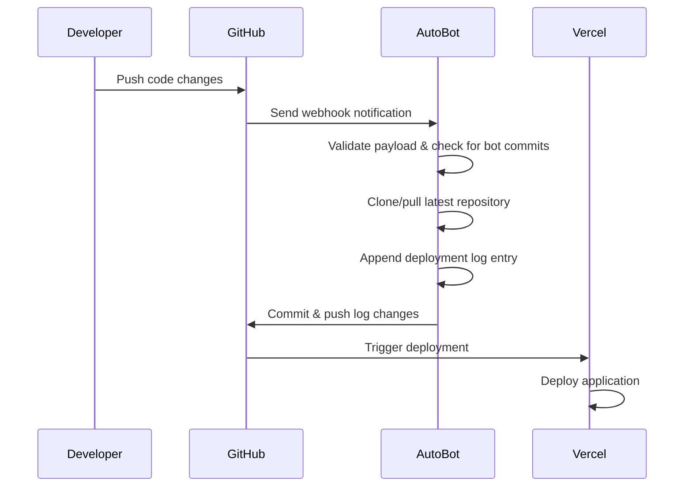

# 🤖 AutoBot

[](https://nodejs.org/)
[](https://opensource.org/licenses/ISC)
[](https://expressjs.com/)

**AutoBot** is an intelligent webhook service that automatically triggers deployments by listening to Private GitHub repository changes. When a push event is detected, AutoBot creates a deployment log entry and commits it back to the repository, triggering automated deployment pipelines (perfect for Vercel, Netlify, etc.).

## 🛠️ Technology Stack

- **Runtime**: Node.js (ES Modules)
- **Framework**: Express.js 5.1.0
- **Git Operations**: simple-git 3.28.0
- **Environment Management**: dotenv 17.2.2
- **Request Parsing**: body-parser 2.2.0

## 📋 Prerequisites

- **Node.js**: Version 16 or higher
- **npm**: Version 7 or higher
- **GitHub Personal Access Token**: With repository access permissions
- **Git**: Installed and configured on your system

## 🚀 Quick Start

### 1. Clone the Repository

```bash path=null start=null
git clone https://github.com/satvikprsd/AutoBot.git
cd AutoBot
```

### 2. Install Dependencies

```bash path=null start=null
npm install
```

### 3. Environment Configuration

Copy the sample environment file and configure it:

```bash path=null start=null
cp .env_sample .env
```

Edit `.env` with your specific values.

### 4. Start the Service

```bash path=null start=null
# Development
npm start

# Or directly with Node.js
node index.js
```

The service will start on the configured port (default: 3000) and display:
```
🚀 Listening on port 3000 for GitHub webhooks...
```

```bash path=null start=null
# For local Webhook testing use ngrok
ngrok http 3000
```

Add the given url to the repo's webhook payload url

## ⚙️ Environment Variables

| Variable | Required | Default | Description |
|----------|----------|---------|-------------|
| `GITHUB_TOKEN` | ✅ Yes | - | Personal Access Token for GitHub API authentication |
| `REPO_URL` | ✅ Yes | - | HTTPS URL of the target GitHub repository |
| `AUTHOR_EMAIL` | ✅ Yes| - | Repo's Owner Email |
| `LOCAL_PATH` | ❌ No | `./repo` | Local directory for repository cloning/operations |
| `BOT_NAME` | ❌ No | `auto-deploy-bot` | Name used for bot commits (avoid infinite loops) |
| `PORT` | ❌ No | `3000` | Port number for the webhook server |

### GitHub Token Setup

1. Go to GitHub Settings → Developer settings → Personal access tokens
2. Generate a new token with the following permissions:
   - `repo` (Full control of private repositories)
   - `workflow` (Update GitHub Action workflows)
3. Copy the token and add it to your `.env` file

## 📡 Webhook Configuration

### GitHub Repository Setup

1. Navigate to your repository on GitHub
2. Go to **Settings** → **Webhooks** → **Add webhook**
3. Configure the webhook:
   - **Payload URL**: `https://your-domain.com/webhook`
   - **Content type**: `application/json`
   - **Which events**: Select "Just the push event"
   - **Active**: ✅ Checked

### Local Development

For local testing, use a tool like [ngrok](https://ngrok.com/) to expose your local server:

```bash path=null start=null
# Install ngrok (macOS) refer https://dashboard.ngrok.com/get-started/setup
brew install ngrok

# Expose local port
ngrok http 3000

# Use the provided HTTPS URL as your webhook endpoint
```

## 🔄 How It Works



## 📁 Project Structure

```
AutoBot/
├── 📄 index.js              # Main application server
├── 📄 package.json          # Dependencies and scripts
├── 📄 package-lock.json     # Locked dependency versions
├── 📄 .env                  # Environment variables (not tracked)
├── 📄 .env_sample           # Environment template
├── 📄 .gitignore           # Git ignore rules
├── 📄 README.md            # This file
└── 📁 repo/                # Cloned repository workspace (auto-generated)
```

## 🐛 Troubleshooting

### Common Issues

**❌ "GITHUB_TOKEN is not set in environment variables"**
- Ensure your `.env` file exists and contains a valid `GITHUB_TOKEN`
- Verify the token has appropriate repository permissions

**❌ "Invalid payload"**
- Check that the webhook is configured to send push events
- Verify the payload URL is correct and accessible

**❌ Git authentication errors**
- Confirm the `GITHUB_TOKEN` has write access to the repository
- Ensure `REPO_URL` is correctly formatted (HTTPS)

**❌ "Error processing webhook"**
- Check server logs for detailed error messages
- Verify the `LOCAL_PATH` directory is writable
- Ensure Git is installed and accessible


## 🚀 Deployment

### Railway

```bash path=null start=null
npm install -g @railway/cli
railway login
railway init
railway up
```

### Heroku

```bash path=null start=null
heroku create your-autobot-app
heroku config:set GITHUB_TOKEN=your_token
heroku config:set REPO_URL=your_repo_url
git push heroku main
```

### Docker

```dockerfile path=null start=null
FROM node:18-alpine
WORKDIR /app
COPY package*.json ./
RUN npm ci --only=production
COPY . .
EXPOSE 3000
CMD ["node", "index.js"]
```

## 🤝 Contributing

1. Fork the repository
2. Create a feature branch (`git checkout -b feature/amazing-feature`)
3. Commit your changes (`git commit -m 'Add amazing feature'`)
4. Push to the branch (`git push origin feature/amazing-feature`)
5. Open a Pull Request

### Development Setup

```bash path=null start=null
# Clone your fork
git clone https://github.com/satvikprsd/AutoBot.git
cd AutoBot

# Install dependencies
npm install

# Copy environment template
cp .env_sample .env

# Edit .env with your test values
# Start development server
npm start
```

## 🙏 Acknowledgments

- [Express.js](https://expressjs.com/) - Fast, unopinionated web framework
- [simple-git](https://github.com/steveukx/git-js) - Lightweight Git interface
- [GitHub Webhooks](https://docs.github.com/en/developers/webhooks-and-events/webhooks) - Event notification system

---

**Made with ❤️ for automated deployments by Satvik Prasad**

*If you find this project useful, please consider giving it a ⭐ on GitHub!*
